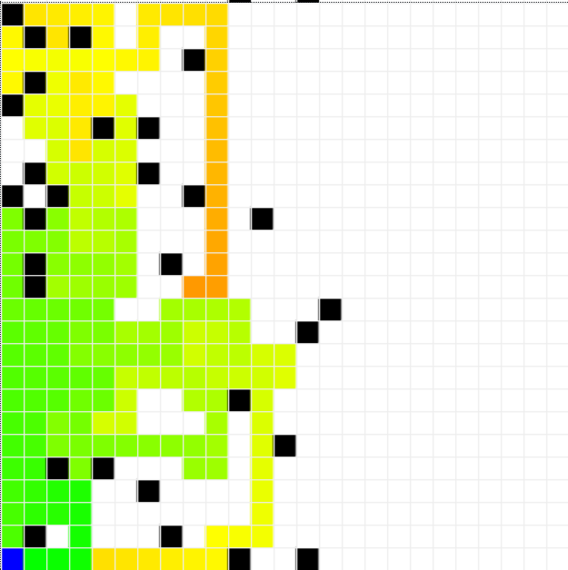

# Roomba

### Problem
Developing a system of agents that can clean a room. The problem involves simulating the behavior of individual and multiple agents to analyze how the number of agents impacts the time spent and the number of movements made.

### Proposal
Using the Mesa library for simulating agents, a model is created which represents the entire simulation. A 2d grid represents the environment, with obstacles, trash, and Roomba agents. These roomba agents move around, cleaning trash and avoiding obstacles. The simulation runs for a specified number of steps or until all roomba agents know that the whole space they can reach has been cleaned.

Roomba agents, trash, and obstacles are placed randomly on the grid. The number of Roomba agents, the size of the grid, and the densities of obstacles and trash are configurable.

The model advances by one step, and a DataCollector collects relevant information about the current state of the model. If the simulation stops, an object is returned, containing information about the simulation results.

The information returned is the number of steps taken, the percentage of trash cleaned, average moves per Roomba agent, and average tiles cleaned per Roomba agent.

## Installation

Use the package manager [pip](https://pip.pypa.io/en/stable/) to install requirements.

```bash
pip install mesa
pip install flask
```

## Usage

```bash
#Runs a web server that lets you visualize the execution
python3 server.py

#Runs a test that runs the model to completion 1000 times and prints the average results
python3 stat_collector.py
```

When running the server you can change the characteristics of the simulation with the sliders to the left of the main view. For these modifications to take place the simulation will have to be reset with the button on the top right.

If you want to change the size of the grid you will have to change it directly in the code for the server, inside the 'server.py' file.

To start the simulation you can either select start to make it automatically go through steps at the speed set in the frames per second slider, or with the step button you can go one step at a time.


When running the statistics collection version of the program you can change the different characteristics of the test inside the 'stat_collector.py' file. This test will print the average results of the simulation in different categories specified in the statistics section of this document.

[Statistics](#statistics)

## Agent Design

### Objective
The main objective of the Roomba Agent is to remove all the trash agents from the grid it lives within.

In order for it to achieve this main objective the agent has other sub-objectives that help it to reach that goal. These other objectives are:

1. Map the whole grid, either as visited or as unreachable.
2. Not running out of battery
3. Find a path from its position to unvisited positions or to a charging station if it has a low battery
4. Distribute work if it can with other agents
5. Communicate with other agents
6. Keep track of its progress

### Actions / Effecting Capacity

Actions that can be taken and when they can be taken 

1. Turn off

        Completed map and inside the original position
        Ran out of battery
2. Recharge
        
        At a charging station and battery less than 100%
3. Clean Trash

        In same position as a trash agent
4. Find path to original charging station

        Far away from charging station and low battery
5. Fill all invalid positions from current position

        Trying to find a path to a new position
6. Communicate with other Roombas

        Has another roomba inside its search radius
7. Move

        Has a valid move
8. Go through known path

        Has a known path and current path is valid
9. Explore randomly

        Can move to an unexplored position
10. Go to last position

        Has a last valid postion
11. Find path to unexplored position

        There is a valid move to an unexplored position
12. Go back to original position to turn off

        There is no valid move to an unexplored position
        The internal map has been completely filled
13. Move randomly

        You have not moved in 5 turns

### Perception
The Roomba agent can see other Roomba agents or obstacles up to 2 tiles away from itself. It can change its path if it notices that some of the tiles that it was going towards have already been cleaned by another agent.

The agent can also see trash that is in the same tile as itself. Because the agent wants to make sure that the complete grid has been mapped it does not try to move towards trash.

#### Map

The main memory that each agent has to know its environment is a dictionary with keys that reflect all possible positions inside of a grid and values that reflect the state of each tile inside the grid.

The map can have different values depending on the knowledge that the agent has about the corresponding tile. These values are:

    0: Unknown tile (White)
    -1: Obstacle tile (Black)
    -2: Unreachable tile (Grey)
    100: Charging tile (Blue)
    1-99: Visited tile (Red -> Green)

The values between 1 and 99 reflect the distance from that tile to a charging station, this value is used to know when to go back to charge. It is most useful with less Roomba agents existing in the simulation.




For the creation of this visualization tool, a new type of canvas was created based on the original one provided by the Mesa python library.

### Proactivity

The Roomba agent tries to reach its goals by always trying to move to clean unexplored parts of its map, finding paths towards different points inside the grid, or proactively moving when it has nothing else to do for several turns in a row.

#### A Star

When deciding on a path to take in order to reach a new position inside the grid, the agents try to find the best possible path to reach that destination while avoiding the obstacles that are in the way.

For this purpose the agents calculate the best path with the A* pathfinding algorithm.

#### Flood Fill

In order to find all the unreachable positions from the agents current position, the agent will try to fill all the map in its memory without going through obstacles. When it finds a position that cannot be reached in any way the agent will mark it as unreachable.

### Performance metrics

The main way that the Roomba agent knows how well it has been performing is by how full its map of the environment is. When its map is completely full it knows that its job is done and that it can go back to its initial position.

Other metrics that can be used to compare the efficacy of different agents is the number of trash tiles it has cleaned or how much movement it did throughout its life cycle.

These metrics can be viewed when running the web server.

Trash through steps


Active vs Inactive agents through steps


Moves made by each agent &ensp; and &ensp; Tiles cleaned by each agent

&ensp;&ensp;&ensp;&ensp;&ensp;&ensp;


### Social Ability

The Roomba Agent can communicate infromation with other agents when near each other, in this way they can more efficiently cover the whole grid.

The way that these agents communicate is by merging their maps of explored positions in the grid.

## Subsumption architecture

In a subsumption architecture diagram the relationship between a situation a and the action that an agent will take in that situation is seen.


## Environment

### Inaccesible
Each agent inside the simulation cannot obtain complete information about the environment it lives within. It has to explore its environment and communicate with other agents in order for it to know its environment.

### Nondeterministic
Each simulation even with the same input, can exhibit different behaviors on different runs. This is because of the random placement of the different agents inside the board, and the random movement of each Roomba agent.

### Episodic
The behaviour of each agent depends only on each step that the model goes through, it does not take into account future steps in its behaviour.

### Static / Dynamic
When there is only one Roomba agent, the model is static because the model remains the same except when the agent itself causes changes to the environment.

When there is more than one Roomba agent, the model is dynamic because other agents cause changes in the environment outside the control of each individual agent, and so they have to take these changes into account.

### Discrete
There is a finite number of positions and actions that can be taken each step.

## Statistics

After running a model with a size of 20x20 tiles 1000 times with a different number of agents, a 10% chance for trash to appear in a tile and a variable chance for an obstacle to appear. The average results obtained are the following:

### 0% chance for an obstacle agent

Agents | Steps | Percentage cleaned | Agent Moves | Tiles Cleaned per agent | Fails
--- | --- | --- | --- | --- | ---
1 | 1000.0 | 64.67% | 792.46 | 25.70 | 0
2 | 774.55 | 98.70% | 585.57 | 19.47 | 0
3 | 544.89 | 99.71% | 393.89 | 13.19 | 0
4 | 416.01 | 99.98% | 293.63 | 9.78 | 1
5 | 353.05 | 100.00% | 233.40 | 7.85 | 0
6 | 319.95 | 100.00% | 198.15 | 6.60 | 0
7 | 306.11 | 100.00% | 170.91 | 5.60 | 0
8 | 301.85 | 100.00% | 152.15 | 4.90 | 0
9 | 304.85 | 100.00% | 137.53 | 4.33 | 1
10 | 295.25 | 100.00% | 122.53 | 3.88 | 0

### 10% chance for an obstacle agent

Agents | Steps | Percentage cleaned | Agent Moves | Tiles Cleaned per agent | Fails
--- | --- | --- | --- | --- | ---
1 | 988.03 | 65.01% | 786.55 | 23.28 | 0
2 | 794.08 | 98.00% | 594.63 | 17.48 | 0
3 | 556.95 | 99.65% | 401.93 | 11.92 | 0
4 | 431.37 | 99.74% | 300.94 | 8.91 | 1
5 | 365.90 | 99.82% | 238.57 | 7.07 | 2
6 | 336.21 | 99.82% | 199.93 | 5.89 | 8
7 | 314.99 | 99.81% | 174.51 | 4.99 | 12
8 | 325.51 | 99.83% | 153.99 | 4.37 | 12
9 | 327.84 | 99.93% | 135.79 | 3.91 | 19
10 | 336.94 | 99.86% | 122.89 | 3.49 | 28

### 20% chance for an obstacle agent

Agents | Steps | Percentage cleaned | Agent Moves | Tiles Cleaned per agent | Fails
--- | --- | --- | --- | --- | ---
1 | 930.31 | 61.48% | 743.88 | 19.70 | 0
2 | 789.47 | 96.77% | 593.17 | 15.61 | 0
3 | 562.46 | 97.99% | 402.67 | 10.46 | 1
4 | 438.21 | 98.12% | 296.16 | 7.84 | 8
5 | 377.91 | 98.38% | 237.65 | 6.17 | 19
6 | 349.84 | 97.85% | 196.96 | 5.16 | 32
7 | 340.38 | 98.19% | 169.19 | 4.37 | 38
8 | 350.54 | 98.37% | 150.00 | 3.88 | 58
9 | 364.01 | 97.92% | 133.38 | 3.40 | 83
10 | 375.15 | 97.92% | 118.85 | 3.07 | 101

## Conclusions

This project provides a way to practice and learn the basics of how an artificial intelligence works. The main complications of this project is the interaction between many different agents that each follow their own goal, and solving the complications that come from that.

This is an interesting project that can be solved in many different ways, and this version can still be optimized and some of its errors can be patched out.

### Known error points
Sometimes the simulation is completely stopped because of an infinite loop, this happens more with more obstacles and Roombas.

The heat map saved for each Roomba is sometimes inaccurate and can lead to the premature death of a Roomba that thinks it has more time to go back to its own charging station, when it does not have that time.

There are some graphical errors in the visualization part of the server, where agents can look as if they have teleported or the graphs can be slightly wrong

### Possible improvements
Use a faster programming language than python or parallelism so that the agents can have a more complicated logic without slowing down the simulation.

Figure out the reason for the fails in the simulation, and fix them.

Create a more accurate heatmap, and make it so the Roombas do not have to go back as often to their original positions.

## Author
Mario Ignacio Frias Pina