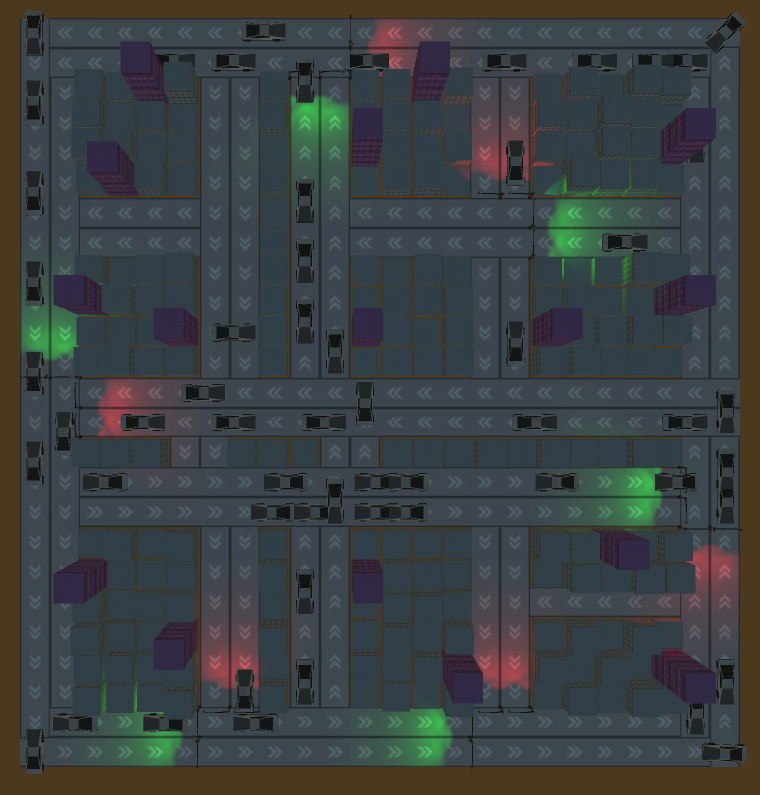
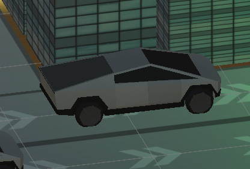
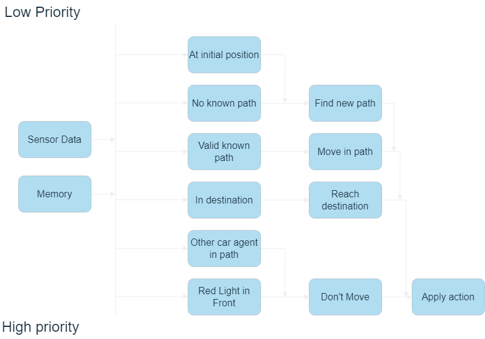
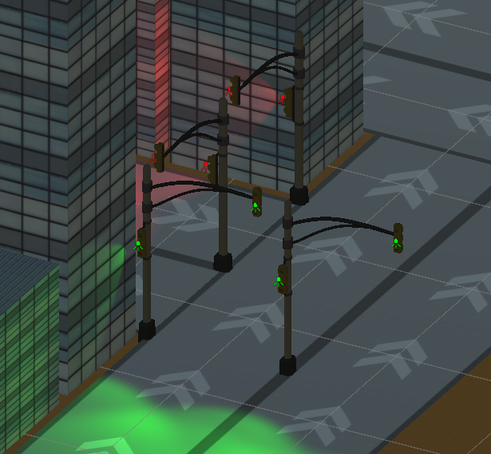
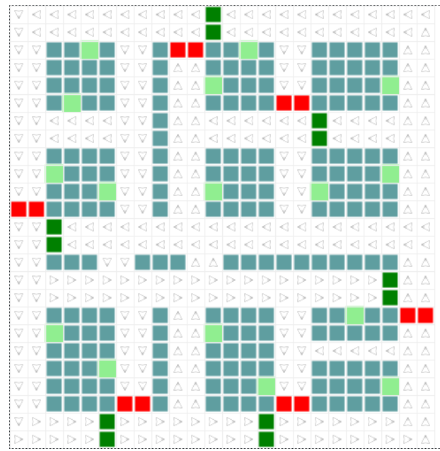

# Traffic Simulation 

# Authors:
- Mario Ignacio Frías Piña
- Shaul Zayat Askenazi


### Problem
Develop a system of agents that can move on a map and reach their respective destinations. The problem consists of simulating the behavior of multiple agents to analyze how the number of agents influences the time spent and traffic efficiency.	

### Proposal
Using the Mesa library for agent simulation, a model is created that represents the entire simulation. A 2D grid represents the environment, with buildings being obstacles, Trafic_Light agents, Destination agents, Road agents and Car agents. These Car agents move through the environment, avoiding obstacles, stopping at traffic lights and checking the proximity of other Car agents before taking any action. The simulation runs for a set number of steps or until all Car agents know that they have reached their destinations, at which point that agent is removed from the simulation. Additionally, to represent them more graphically and clearly, the simulation is created within a Unity 3D environment.

A JSON dictionary file and a city_maker.txt file are used to determine the positions of the agents Obstacle, Trafic_Light, Road  
and Destination. These will simulate a city environment and traffic.



## Installation

Use the [pip](https://pip.pypa.io/en/stable/) package manager to install the requirements.

```bash
pip install mesa
pip install flask
```

## Use

```bash
## Runs a web server that allows you to visualize the execution in mesa's visualizer

python3 Agentes/traffic/server.py

## Runs a web server that allows you to visualize the execution in a unity visualizer

python3 Agentes/server.py

## Runs the simulation with no visualizer

python3 Agentes/traffic/stat_collector.py
```
When running the server you can from Unity modify the characteristics of the simulation with the maps and indicate how many steps you want new Car agents to be instantiated.

To start the simulation you can select start in Unity with your flask server running.

When running the statistics collection version of the program you can change the different test characteristics within the 'stat_collector.py' file. This test will print the average simulation results in different categories specified in the statistics section of this document.

## Agent Design

### Car Agent



### Objective
The main objective of the Agent Car is to reach its destination.

In order for it to achieve this main objective the agent has other sub-objectives that help it reach that goal. These other objectives are:

1. Respect the sense of direction.
2. To stop if he encounters Traffic_Light on red.
3. Find a way from your current position in case there is traffic. 
4. Track your progress

### Actions / Effective Capacity

Actions that can be taken and when they can be taken 

1. Stop

        Red light in front
        You have other Car agents in your path
2. Reach your destination

        In the same position as the Destination agents
3. Move
        
        On a road with a valid direction and movement and agent has a calculated path and that path is valid.
4. Find new path to your destination

        No known path
        At initial position

### Perception

The Car agent can see other Car agents and traffic lights up to 1 square in front of himself. He can change his path if he notices that one of the tiles he is heading towards has already been positioned by another agent.

The agent can also see the direction of the road he is on.

### Map

The main memory that each agent has to know its environment is a dictionary with keys that reflect all possible positions within a grid and values that reflect the state of each tile within the grid.

The Car agent has knowledge of the entire map except for the position of other Car agents and the status of the traffic lights.

### Proactivity

The agent Car tries to reach its objectives trying to move always to its destination place finding the way in all the map from its initial position.

### A star

When deciding the path to follow to reach a new position within the grid, the agents try to find the best possible way to reach that destination avoiding obstacles along the way.

To do this, the agents calculate the best path with the A* path finding algorithm.

### Performance metrics

The performance metrics for the Car agent are:

1. The distance between Car and Destination
2. Time it takes for a Car to reach its destination.

The perfromance metrics for the complete simulation are:

1. Agents that reached their destination
2. Number of agents at the same time in any given step
3. Maximum number of agents at the same time in the simulation

### Social capability

The Car agent does not possess the ability to communicate with other agents.

## Subsumption architecture

A subsumption architecture diagram shows the relationship between a situation and the action an agent will take in that situation.



### Traffic Light Agent



The traffic light agent has one action, to change its state from green to red, or red to green. Depending on the current cars that are on the road in front of it and its connected traffic lights.

These traffic lights are connected to its partner beside it and to its opposite lights at the other side of the intersection where it is located.

From these 4 traffic lights one is selected as the one that will change the state of all connected traffic lights. This traffic light will then count the number of cars that are on each side and turn green if the number of cars is bigger on that side.

## Environment

### Inaccessible
Each agent within the simulation cannot obtain complete information about the environment in which it lives. It has to explore its environment and communicate with other agents in order to learn about its environment.

### Partially deterministic
It is known that in the simulation the car is going to want to reach its Destination position, however, we do not know how that path will be, if it will pause or choose other paths.
### Non Episodic
The behavior of each agent does not depend only on each step the model goes through, it takes into account future steps in its behavior such as the previous definition of looking for its destination.

### Dynamic
The model is dynamic because other agents cause changes in the environment outside the control of each individual agent, so they must take these changes into account.

### Discrete
There are a finite number of positions and actions that can be taken at each step.

## Statistics

After running each simulation for 1000 steps and the 2023 map, the following statistics are gathered:

- Agents that reached their destination
- Average distance between Car and Destination
- Average time it takes for a Car to reach its destination
- Maximum number of agents at the same time in the simulation

#### Map


### Base Scheduler

Steps between new agents | Average distance | Average time reaching destination | Maximum number of agents | Agents that reached their destination
--- | --- | --- | --- | ---
1 | 26.68 | 30.40 | 320 | 114
2 | 37.33 | 58.34 | 145 | 1855
3 | 37.30 | 42.75 | 73 | 1267
4 | 38.17 | 42.03 | 54 | 952
5 | 36.93 | 39.25 | 40 | 760

### Random Activation Scheduler

Steps between new agents | Average distance | Average time reaching destination | Maximum number of agents | Agents that reached their destination
--- | --- | --- | --- | ---
1 | 36.91 | 114.18 | 304 | 804
2 | 26.60 | 101.43 | 223 | 1174
3 | 37.70 | 48.57 | 87 | 1262
4 | 38.06 | 42.98 | 54 | 952
5 | 38.27 | 41.57 | 43 | 757

## Conclusions

This project provides a way to practice and learn the basics of how an artificial intelligence works. The main complication of this project is the interaction between many different agents, each pursuing its own goal, and solving the complications that arise from that.

This is an interesting project that can be solved in many different ways, and this version can still be optimized and some of its bugs can be fixed.

### Possible improvements

When a Car agent is without movement, each step recalculates its route using A*. The improvement would be to keep the previous calculation in motion.

When a Car agent is stopped with two agents in front of it, it starts moving from right to left. This makes them keep calculating routes all the time. The expected behavior is that it looks for its shortest path and stays in that position until its neighbors move.

Improve agents' motion interpolation for smoother animations in Unity